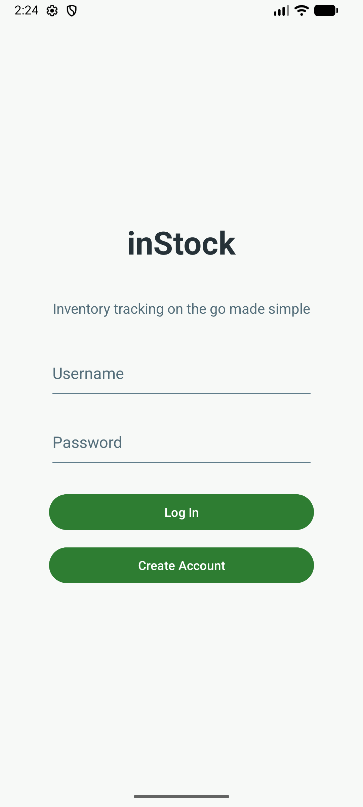
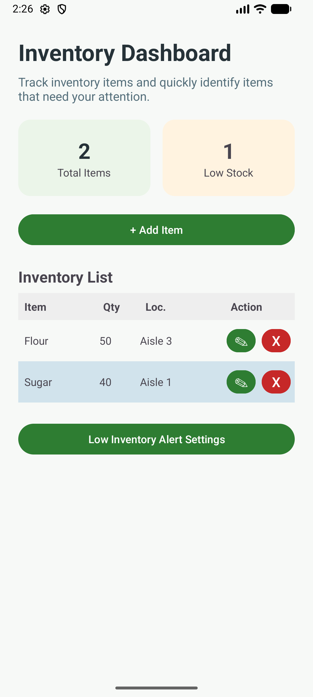
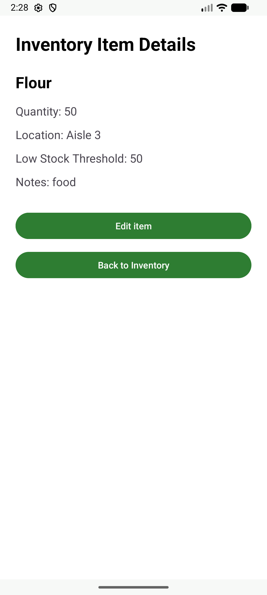

## inStock Inventory App

---

### Technology

* Android Studio
* Java
* XML layouts
* Android Fragments
* SQLite / local database concepts
* Mobile UI design principles

---

### CS 360: Mobile Architecture and Programming Portfolio Artifact

The inStock Inventory App is an Android application that helps users track inventory items, manage quantities, and 
receive alerts when stock is low. I created this project for CS 360 Mobile Architecture and Programming to demonstrate 
my skills in mobile app development, user-focused design, database integration, authentication, and notification 
planning.

---

### Project Overview

The goal of this app was to build a mobile-first inventory tool for people like small business owners, warehouse 
workers, and hobby sellers who need an easy way to track products and inventory levels. The app aims to replace manual 
spreadsheets and make it simple to view, add, update, and manage inventory from a phone.

Having run a small business before, I know how challenging inventory management can become during busy times, supply 
issues, or frequent product changes. This project allowed me to design an app around a real need while applying the 
Android development skills I learned throughout the course.

---

### App Requirements and Goals

The main requirements of the app were to support user login, store inventory data, display inventory items in a 
grid-based layout, allow users to manage item quantities, and prepare for SMS notification permissions related to low 
inventory alerts.

The app was designed to address the following user needs:

* A simple way to view current inventory items
* The ability to add and manage product information
* Clear visibility into item quantities
* A user-friendly interface that works well on a mobile screen
* Notification support for low inventory awareness
* A secure login flow to protect user data

---

### Screens and Features

The app includes several key screens and features that support the user experience.

#### Login Screen

The login screen provides users with a clear entry point into the application. This screen supports the goal of 
protecting inventory information and creating a more complete app experience.

[//]: # (Using img tags here to adjust size)

#### Inventory Dashboard Screen

The inventory screen is the main part of the app. It shows items in a grid so users can quickly see item names, 
quantities, and details. I chose this layout because it is easy to read and helps users review inventory quickly.

[//]: # (Using img tags here to adjust size)

#### Inventory Item Details Screen

The inventory item details page provides additional details and notes, as well as an entry point to be able to edit the
current item. 

[//]: # (Using img tags here to adjust size)

#### Notification Permission Screen

I included a notification and SMS permission screen to support future low-inventory alerts. This feature lets users 
decide when to allow notifications by clearly showing the request and giving them the choice to enable or delay access.

[//]: # (Using img tags here to adjust size)

---

### User-Centered UI Design

The UI design focused on simplicity, readability, and ease of use. Since inventory management can involve repeated daily
use, the design needed to avoid unnecessary complexity. I used a clean layout, readable spacing, clear action buttons, 
and screen-specific organization to help users complete tasks quickly.

By using Fragments, I was able to separate each screen into its own part of the app. This made it easier to manage how 
users move through the app and allowed each screen to focus on a specific task, such as logging in, viewing inventory, 
or handling notifications.

The designs worked well because they kept the main user goals clear and easy to reach. Users can quickly see where they
are in the app, what actions are available, and how to manage their inventory.

---

### Development Approach

I built the app step by step. I started with the UI structure from an earlier design milestone and used it as the base 
for the working code in Project Three.

Some of the strategies I used included:

* Breaking the app into Fragments to keep screens organized
* Using layout files to separate UI structure from logic
* Building features incrementally instead of trying to complete everything at once
* Testing small pieces of functionality as they were added
* Keeping the user flow in mind while connecting screens and features

This approach made the project easier to manage. In the future, I plan to use the same method: start with a clear 
design, break the app into smaller parts, and connect the UI to the application logic step by step.

--- 

### Testing and Functionality

Testing played an important role in the development process because it helped verify that the application worked as 
intended. I tested the app by launching it in Android Studio and checking each major component, including screen 
navigation, inventory display, item management, login behavior, and permission-related screens.

This process was essential because mobile applications can behave differently depending on the device layout, screen 
size, permissions, and user interaction. Testing helped confirm that the core features worked correctly and revealed 
areas where the layout, navigation, or functionality could be improved.

---

### Challenges and Innovation

One of the main challenges I had to overcome was organizing the app’s structure to support multiple screens and features 
without making it difficult to manage. Since this project included login functionality, inventory display, database 
interaction, and notification planning, it was important to avoid placing too much logic into one area of the app.

Using a Fragment-based structure helped solve this challenge. It allowed me to treat each screen as its own focused part 
of the application while still keeping the overall app connected. This helped me better understand how modern Android 
applications can be structured as they grow.

Another challenge was designing the inventory screen so that it was useful but not overcrowded. I had to balance 
displaying enough information for the user while keeping the screen readable and easy to interact with on a mobile 
device.

---

### Area of Strength

The component I was most successful with was the inventory interface and overall screen organization. I applied the UI
design from Project Two and used it as the foundation for the functional app in Project Three. The inventory screen 
demonstrates my understanding of mobile layout design, user-centered thinking, and organizing app features around real 
user needs.

I am also proud of how the project connects my own experience with inventory management to the technical requirements 
of the course. This made the app feel more practical and helped guide the design decisions throughout the project.

---

### What I Learned

This project helped me better understand the full mobile app development process, from planning and UI design to 
implementation and testing. I gained more experience working with Android Studio, XML layouts, Fragments, permissions, 
and app navigation.

The biggest takeaway for me was the importance of planning the app structure before writing too much code. A clear 
structure makes the app easier to build, test, and improve over time.

### Reflection

Overall, this project helped me connect mobile application design with practical software development. I was able to 
design an app around a real user need, build a functional Android application, and reflect on how design decisions 
affect usability. The inStock app represents my growth in mobile architecture, Android development, and user-centered 
design.